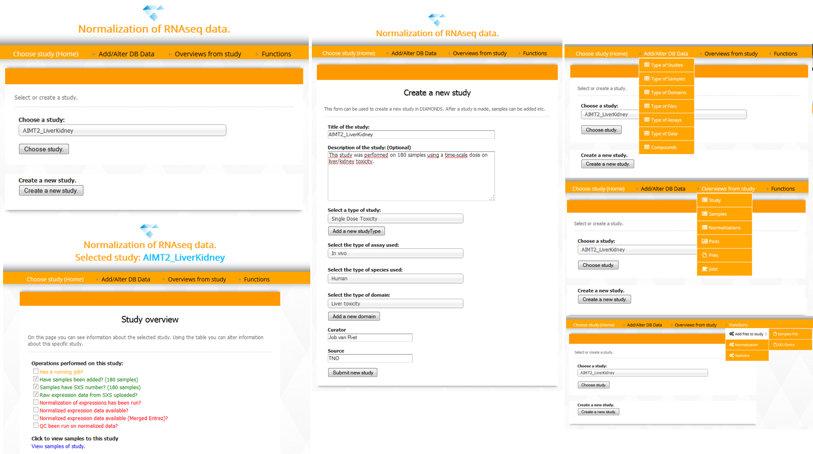
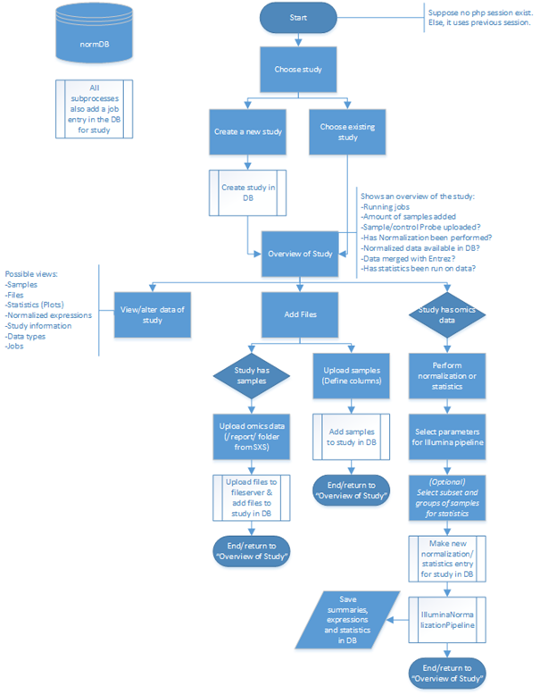
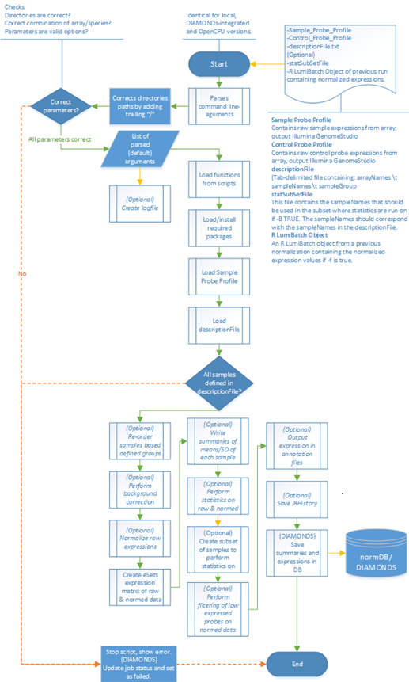
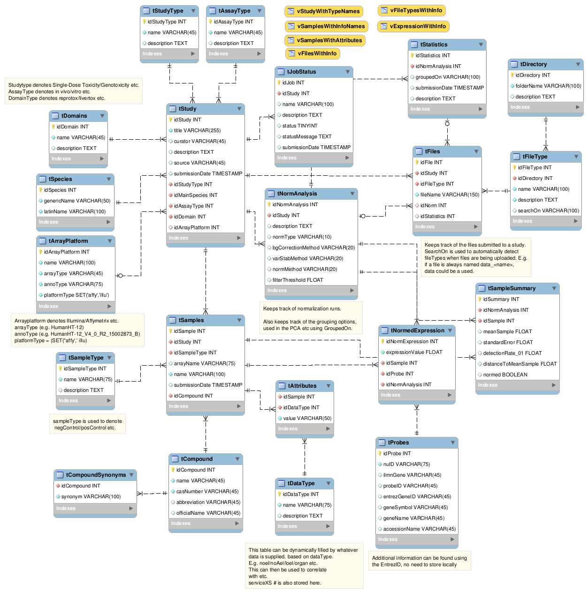

webIlluminaNormalization
========================

Pipeline and back-/front-end web interface for Illumina normalization.

Interface, pipeline and database for background correction, normalization, variance stabilization, quality assessment and statistics of Illumina Beadchip data using the methods found in the limma and lumi packages using a web interface in which samples/Illumina omics data can be uploaded, stored and analyzed.

**Pipeline based on [ArrayAnalysis](http://www.arrayanalysis.org/) developed by: Department of Bioinformatics - BiGCaT Bioinformatics and Systems Biology Research Group Maastricht University - The Netherlands**

##Description

This is a complete web-front-/back-end application used in the normalization of Illumina gene-expression data.

A web-interface has been designed to allow for easier implementations of the Illumina normalization pipeline and the subsequent storing and viewing of data. This has been designed in conjunction with a MySQL database.

The general process-flow of this interface is designed as thus:

The user has to create a new “study” or select an exist “study”. This study is used to keep track of the samples included in the study and all the operations performed on this study, alongside all the files that have been uploaded/outputted.

When the user has selected a study, samples can be added to this specific study. The samples are defined as the experimental samples performed on the (gene-expression) microarray. These samples can be supplied with additional information such as which compound is used, type of sample (positive control / negative control / sample etc.) and all other relevant information to the study such as the NOEL / NOAEL / LD50, RNA concentration etc. This is a modular design and has no limit to the amount of information is supplied per sample. The uploaded samples can be viewed and modified using the web-interface.

When samples have been added, omics data can also be added. The required files in order to perform normalization are the Sample Probe Profile and Control Probe Profile containing the fluorescent values signifying expressional relativity of the samples and control probes. An extra tab-delimited file containing the names of the samples as defined on the array and the names of the samples as defined by the user should also be uploaded. This is used to match the correct samples to the microarray.

When both samples and omics data has been uploaded to the study, a normalization can be run using user-selected methods and options for the pipeline such as, amongst others, the method of normalization, whether to perform filtering and which statistics should be run. The user can also specify a subset of samples upon which the statistics should be run, this is useful when it is interesting to look at any a specific group of samples.

When normalization has been run, statistics can be run on this normalized data again, also with a subset of samples, without performing normalization.

All plots, files, jobs, samples and additional information from a specific study can be viewed, downloaded and/or altered

##Installation/Setup

- Upload the scripts from the /diamondsNorm/ folder, using the same folder structure, on a web-server running:
  - Apache *(Version >= 2.4 + HTML5 support)*
  - PHP5
  - MySQL *(Version >= 5.0)*
  - R *(Version >= 2.0)*
- *(Optional) Set correct permissions on files and folders.*
- Create the database using the SQL code provided in the /sql/ folder. (Change the username/password)
- *(Optional) Use the provided sample data to fill the database with options from the /sql/sampleData.sql file.*
- Change the security usernames/password and other logins and paths in the /logic/config.php file.
- Change the MySQL user/password for the RMySQL functions in R in /R/functions_myDB.R file.

##Examples

Example files are available in the /example/ folder.

##Impression interface

Shows only a few pages of the web-interface.

#Flowcharts

##Flowchart of interface design

##Flowchart of pipeline

##ERD

